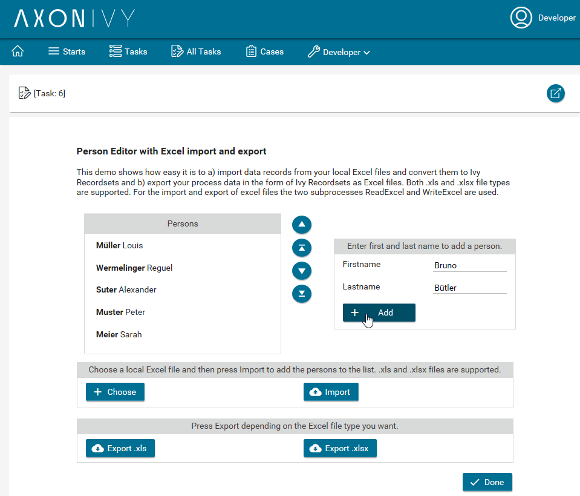
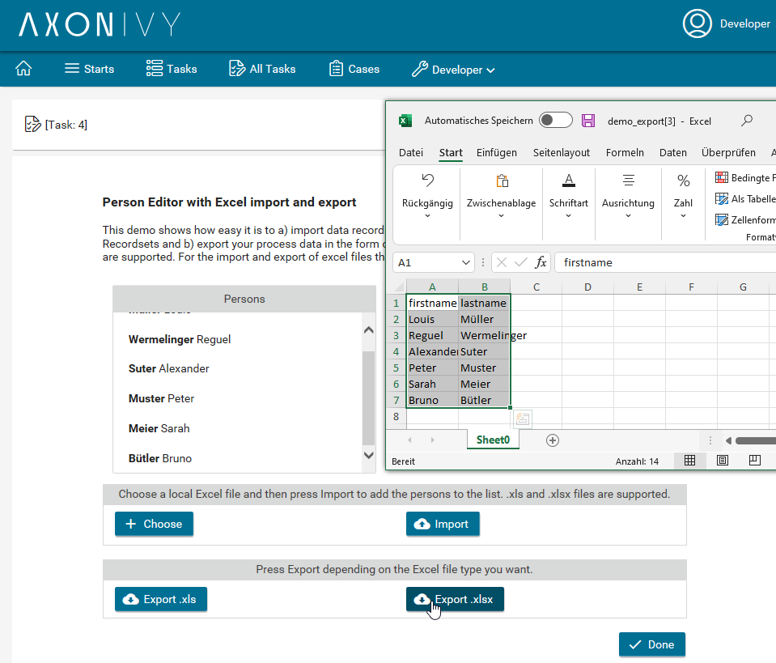

# Excel Connector
The **Axon Ivy Microsoft Excel connector** facilitates process automation by providing seamless interaction with MS Excel files. Key features include:

- **Excel File Import**: Convert a local MS Excel file into any Ivy Recordset, enabling easy data manipulation within your business process.
- **Excel File Export**: Export Ivy Recordsets back into an MS Excel file, ensuring efficient data output for external use.

This connector integrates MS Excel into your automated workflows, making it easier to manage data flows between your processes and spreadsheets.

## Demo

