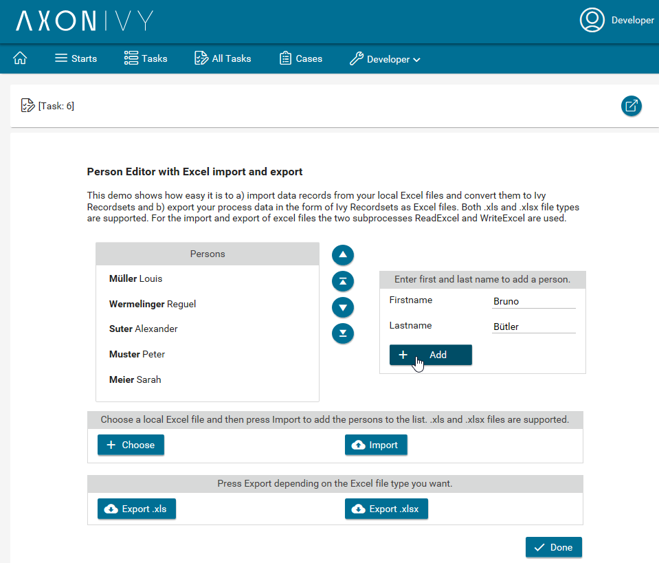
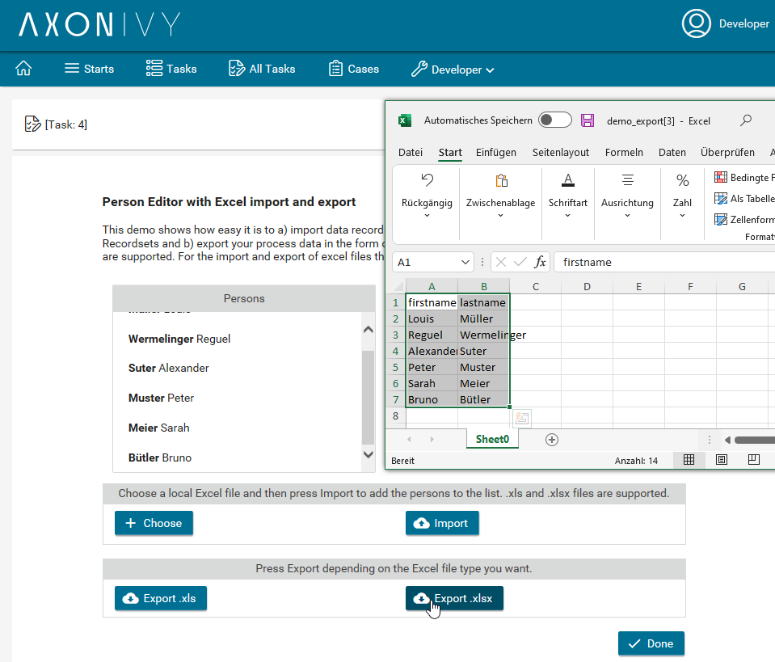

# Excel Konnektor
Der **Axon Ivy Microsoft Excel Konnektor** erleichtert deine Prozessautomatisierung, indem er eine einfach zu bedienende Interaktion mit MS Excel-Dateien ermöglicht. Zu den wichtigsten Funktionen gehören:

- **Excel-Datei-Import**: Konvertiere eine lokale MS Excel-Datei in ein beliebiges Ivy Recordset, um eine einfache Datenmanipulation in Deinem Geschäftsprozess zu ermöglichen.
- **Excel-Datei-Export**: Exportiere Ivy Recordsets zurück in eine MS Excel-Datei, um effiziente Datenausgabe für die externe Nutzung sicherzustellen.

Dieser Konnektor integriert MS Excel in Deine automatisierten Workflows und erleichtert das Verwalten von Datenflüssen zwischen Deinen Prozessen und Tabellen.

## Demo

