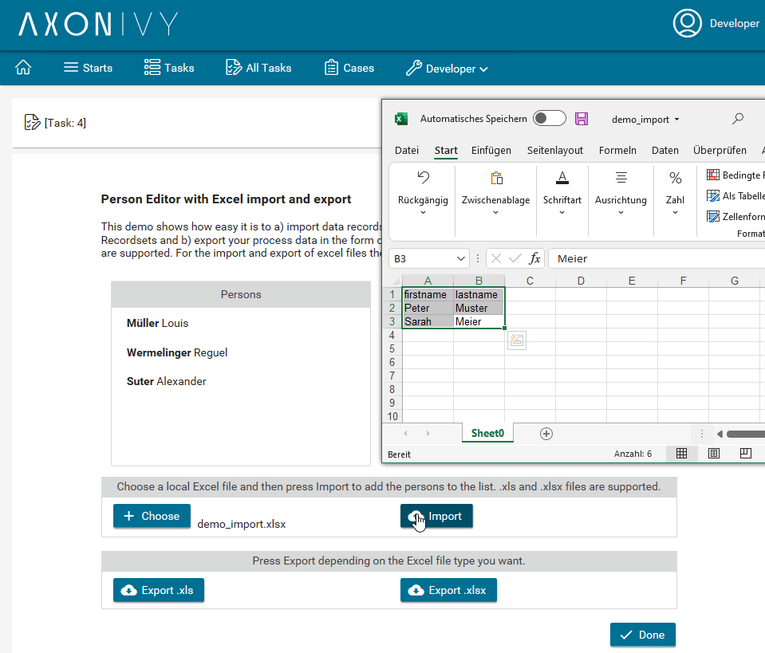

# Excel-Konnektor
** Der Axon Ivy Microsoft Excel-Konnektor **erleichtert die
Prozessautomatisierung durch die nahtlose Interaktion mit MS Excel-Dateien. Zu
den wichtigsten Funktionen gehören:

- **Excel-Datei-Import-**: Konvertieren Sie eine lokale MS Excel-Datei in ein
  beliebiges Ivy-Recordset, um eine einfache Datenbearbeitung innerhalb Ihres
  Geschäftsprozesses zu ermöglichen.
- **Excel-Datei-Export**: Exportieren Sie Ivy-Datensätze zurück in eine MS
  Excel-Datei und gewährleisten Sie so eine effiziente Datenausgabe für die
  externe Verwendung.

Dieser Konnektor integriert MS Excel in Ihre automatisierten Workflows und
erleichtert so die Verwaltung von Datenflüssen zwischen Ihren Prozessen und
Tabellenkalkulationen.

## Demo

  
